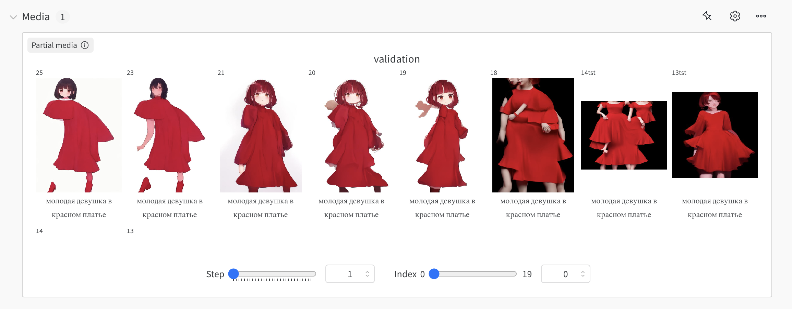

  

# ⚡️Waifu: Efficient High-Resolution Waifu Synthesis

  

## Train in progress!

[logs](https://wandb.ai/recoilme/waifu-2b)

  

Prompt: 1girl, solo, animal ears, bow, teeth, jacket, tail, open mouth, brown hair, orange background, bowtie, orange nails, simple background, cat ears, orange eyes, blue bow, animal ear fluff, cat tail, looking at viewer, upper body, shirt, school uniform, hood, striped bow, striped, white shirt, black jacket, blue bowtie, fingernails, long sleeves, cat girl, bangs, fangs, collared shirt, striped bowtie, short hair, tongue, hoodie, sharp teeth, facial mark, claw pose

19.12:

20.12: 

Burned money: ~$1000
Pls, let' us know if you have some money or GPU for training opensource waifu model, contacts: [recoilme](https://t.me/recoilme)

## 💡 Introduction

tldr; We just need a model to generate waifu

We introduce Waifu, a text-to-image framework that can efficiently generate images up to 768 × 768 resolution on 80+ languages. Our goal was to create a small model that is easy to full finetune on custom GPU, but without compromising on quality. It's like a SD 1.5, but developed in 2024 using the most advanced components at this moment. Waifu can synthesize high-resolution, high-quality images of waifu with strong text-image alignment at a remarkably fast speed, deployable on laptop GPU.

Core designs include:

(1) [**AuraDiffusion/16ch-vae**](https://huggingface.co/AuraDiffusion/16ch-vae): A fully open source 16ch VAE. Natively trained in fp16. \
(2) [**Linear DiT**](https://github.com/NVlabs/Sana): we use 1.6b DiT transformer with linear attention. \
(3) [**MEXMA-SigLIP**](https://huggingface.co/visheratin/mexma-siglip): MEXMA-SigLIP is a model that combines the [MEXMA](https://huggingface.co/facebook/MEXMA) multilingual text encoder and an image encoder from the [SigLIP](https://huggingface.co/timm/ViT-SO400M-14-SigLIP-384) model. This allows us to get a high-performance CLIP model for 80 languages.. \
(4) Other: we use Flow-Euler sampler, Adafactor-Fused optimizer and bf16 precision for training, and combine efficient caption labeling (MoonDream, CogVlM) and danbooru tags to accelerate convergence.

As a result, Waifu-2b is very competitive with modern giant diffusion model (e.g. Flux-12B), being 20 times smaller and 100+ times faster in measured throughput. Moreover, Waifu-2b can be deployed on a 16GB laptop GPU, taking less than 1 second to generate a 768 × 768 resolution image. Waifu enables waifu creation at low cost.

 // AiArtLab team